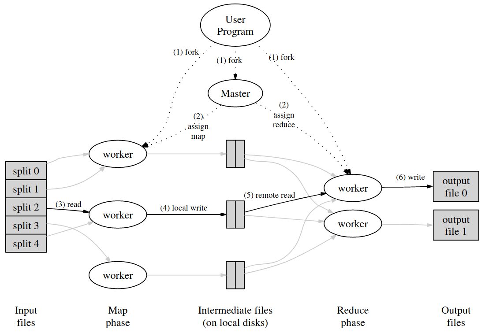

# Homework 1

Am scris READMEul in engleza ca sa pot posta tema pe GitHub.

> Description: Write a parallel program that uses the Map Reduce paradigm to
> perform statistics on plain-text documents.

## Map Reduce Paradigm

A paper on the
[MapReduce](https://static.googleusercontent.com/media/research.google.com/en//archive/mapreduce-osdi04.pdf)
Paradigm paints a thousand words about the execution overview in a picture.

And states that in each phase, we have multiple k's and v's that are
transformed.

> map(`k1`, `v1`) `->` list(`k2`, `v2`)
>
> reduce(`k2`, `list(v2)`) `->` list(`v3`)

## My interpretation

### Generic Operations

In the initial stage, I wrote the [MapOperation](MapOperation.java) and
[ReduceOperation](ReduceOperation.java) classes. (Note: I also checked out
before the [Apache Hadoop](https://hadoop.apache.org/) implementation.)

In essence a `MapOperation` takes in a (`k1`, `v1`) pair, and produces a list of
new (`k2`, `v2`) pairs.

A `ReduceOperation` takes in a key, `k2`, and all the values, `list(v2)`,
associated with in that were mapped in the last phase, and produces another list
of possibly different typed values, `list(v3)`.

Since, both of them implement `Callable`, this allows to programmer to work with
a familiar interface, which they could pass to a `ExecutorService` of their own.

In order to create custom classes, just extend the ones before, for your own
need. As such, I created the [MapDoc](MapDoc.java) and
[ReduceDoc](ReduceDoc.java) child classes. As you can see, the only logic in
them is in the `call()` method.

### The Master

Even though he is the master, he deals with the dirty work that nobody wants to
do. Such as collecting the outputs and grouping them.

It may seem that the most important job he does is to maintain all the available
workers busy, and assigning them tasks. But this is false. If you check out the
code there is one [`for`](MasterMapReducer.java#L41) that does this assigning
for the map phase, and another [`for`](MasterMapReducer.java#L61) for the reduce
phase. This is because the master is "smart" and subcontracts the management of
the workers to the `ExecutorService`.

For the map phase, we collect each list generated by each map operation, and
link this lists together, or flatten them if you want to think of it this way.
After we have a flat list of all the `k2`s and `v2`s, we group the `v2`s in a
list by `k2`. See this [collect's](MasterMapReducer.java#L47) code.

For the reduce phase, we collect each list generated by each reduce operation,
and link this lists together, or flatten them if you want to think of it this
way. After which we just return this list of all the `v3`s. See this
[collect's](MasterMapReducer.java#L67) code.

## An actual implementation

### Tema2

Until now, I have talked only about the generic framework set up. The "meat" of
this implementation, starts in [Tema2](Tema2.java).

As a good and obedient program, it treats all the errors it may encounter (or at
least the ones I thought about :)).

It then creates an instance of a `MasterMapReducer` with the number of workers
in the input.

After parsing a little more of the input, it sends `MapDoc` tasks to the master.
When the map phase is done, it creates `ReduceDoc` tasks with the input of the
last phase. See this [code](Tema2.java#L51). The `main` method instantiating the
`ReduceOperation`s is the only lack of generics I hope you find in this
framework.

At last, the homework just sorts the reduce phase results, and outputs them one
by one.

### MapDoc

After being assigned a fragment, a map task seeks at the end of the respective
fragment and looks ahead in the input file for the ending position of the last
token.

If order to skip incomplete tokens at the start of the input token and asks
whether both the first character and the one before are not delimiters.

The next part is a classic spit in tokens of the read fragment, making a map of
the lengths of each word, and the count of that length, plus a list of all the
longest works. (If I might say, too long a README.)

At the end, it wraps the map and list in a `IntermediateResult` list and ships
them away.

### Reduce Doc

(Now where getting somewhere.)

Each reduce operation, after filtering `IntermediateResult` with no words, makes
very basic calculations, e.g. the total word count, the length of the longest
word, and how many such long words appear.

Now comes in Fibonacci. After all of former operations are done, we add each
word length * fib(length) + count, to sum them all up. Divide by the number of
total words and we're done!

I added this Fibonacci paragraph to illustrate an optimization I pulled
"caching" the Fibonacci values up to the length of the longest words before
using them, and distributing them. This permits a future improvement of this
project with synchronized arrays, this was not included for now, for

> the price of perfection is infinite - see
> [CGP GREY](https://www.youtube.com/watch?v=ua4QMFQATco)

---

# Conclusion

This is my modest and amateur take on this homework and on the MapReduce
paradigm. The main feature that I wanted was to give the programmer more control
over the framework. This in consequence, leaves little room for more
optimizations and is not a good tool in distributed systems. But, to end in a
happier note,

> Simplicity is not a simple thing - Charlie Chaplin
